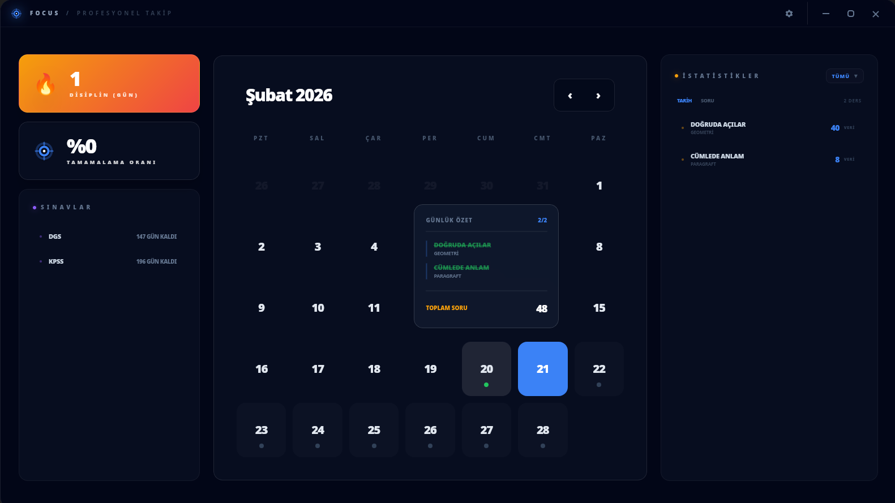

Focus, Rust (Tauri) ve React kullanılarak geliştirilmiş, modern ve yüksek performanslı bir çalışma takip uygulamasıdır. Ders çalışma sürelerinizi, çözdüğünüz soru sayılarını ve günlük hedeflerinizi şık bir arayüzle takip etmenizi sağlar.

> [!NOTE]
> Bu proje, Electron'un ağır bellek kullanımına alternatif olarak Rust'ın gücünü kullanan bir performans denemesidir.

## Neden Rust & Tauri?

Geleneksel Electron uygulamaları (Visual Studio Code, Discord vb.) tipik olarak **1.2 GB+** RAM tüketirken, Rust(Tauri) aynı işlevi **~500 MB** civarında bir bellek kullanımıyla sunar. Bu, %50'den fazla performans artışı ve daha düşük sistem kaynağı tüketimi anlamına gelir.Her neyse projeye geri dönelim.

##  Özellikler

- 📅 **Gelişmiş Takvim:** Günlük çalışma verilerini görselleştirin.
- 📊 **İstatistikler:** Ders ve konu bazlı soru sayıları ve ilerleme raporları.
- 📋 **Planlama:** Gelecek günler için ders programı ve girilen sınav tarihine kadar hedef belirleme.
- 🎨 **Modern Arayüz:** Akıcı animasyonlar ve şık tasarım.

## 📦 İndirme ve Kurulum

Programı kullanmaya başlamak için en kolay yol, derlenmiş paketleri indirmektir.

1. **GitHub Releases:** En güncel kararlı sürümleri [Releases](https://github.com/herzane52/focus/releases) sayfasından indirebilirsiniz. Kurulum talimatları sayfada yer almaktadır.

### Desteklenen Paketler
- 🐧 **Debian/Ubuntu:** `.deb` paketi.
- 📦 **AppImage:** Tüm Linux dağıtımları için kurulum gerektirmeyen taşınabilir sürüm.
- 🏔️ **Arch Linux:** Hazır paketi indirebilir veya PKGBUILD ile kendiniz paketleyebilirsiniz.

## 🛠️ Geliştirme ve Kaynak Koddan Derleme

Eğer projeye katkıda bulunmak veya en güncel geliştirme sürümünü denemek isterseniz aşağıdaki adımları takip edebilirsiniz.

### Gereksinimler

- [Node.js](https://nodejs.org/) (npm ile birlikte)
- [Rust](https://www.rust-lang.org/tools/install)
- [Tauri CLI](https://tauri.app/v1/guides/getting-started/prerequisites)

### Kurulum ve Çalıştırma

1. Projeyi klonlayın:
   ```bash
   git clone https://github.com/herzane52/focus.git
   cd focus
   ```

2. Bağımlılıkları yükleyin:
   ```bash
   npm install
   ```

3. Test etmek amacıyla geliştirme modunda çalıştırın:
   ```bash
   npm run tauri dev
   ```

### Paketleme (Build)

Uygulamayı kendiniz paketlemek isterseniz iki yöntemden birini kullanabilirsiniz:

#### Yöntem A: İki Aşamalı Yapı (Önerilen)

Bu yöntemde önce **hazırlık** adımını **bir kez** çalıştırırsınız; ardından ihtiyacınıza göre sadece istediğiniz paketi üretirsiniz. Bu sayede aynı build'i birden fazla kez tekrarlamak zorunda kalmazsınız.

1.  **Aşama 1: Hazırlık (Bir kez yapılması yeterlidir)**
    ```bash
    npm run build:prep
    ```

> [!TIP]
> `build:deb`, `build:appimage` ve `build:arch` scriptleri `build:prep`'i **içermez**. Hazırlık adımını atlamamaya dikkat edin.

2.  **Aşama 2: İstediğiniz paketi ayrı ayrı üretin**
    - **Debian paketi:**
      ```bash
      npm run build:deb
      ```
    - **AppImage:**
      ```bash
      npm run build:appimage
      ```
    - **Arch Linux:**
      ```bash
      npm run build:arch
      ```


#### Yöntem B: Hepsi Bir Arada (Tam Build)

Tüm paketleri tek komutla üretmek için (hazırlık adımı dahil otomatik çalışır):
```bash
npm run build:all
```

> [!TIP]
> Derleme çıktıları `build/packages/` klasörü altında toplanır. Paketi oluşturduktan sonra kurulum için [Releases](https://github.com/herzane52/focus/releases) sayfasındaki talimatları takip edebilirsiniz.

### Arch Linux alternatif olarak (PKGBUILD) ile Kurulum

Bu yöntem, `PKGBUILD` dosyamızın mevcut `.deb` paketindeki ikonları ve sistem yapılandırmalarını kullanan bir "repacker" (yeniden paketleyici) olarak tasarlanmış olması nedeniyle **önce Debian paketinin oluşturulmuş olmasını** gerektirir.

**Kurulum Adımları:**
1.  Eğer henüz yapmadıysanız, `npm run build:deb` komutuyla Debian paketini oluşturun.
2.  Ardından proje kök dizininde şu komutu çalıştırın:
    ```bash
    # Proje dizinindeyseniz:
    makepkg -si
    ```

### AUR Üzerinden Kurulum (Yakında)
> [!IMPORTANT]
> Şu an için AUR desteği sunulmamaktadır. Eğer topluluktan çok yoğun talep gelirse gelecekte eklenebilir.

## Katkıda Bulunun

Bu benim Rust/Tauri ile ilk projem olduğu için geri bildirimleriniz ve katkılarınız çok değerlidir. Bir hata fark ederseniz veya bir özellik eklemek isterseniz lütfen bir çekme isteği (PR) gönderin veya bir hata kaydı (Issue) açın.
